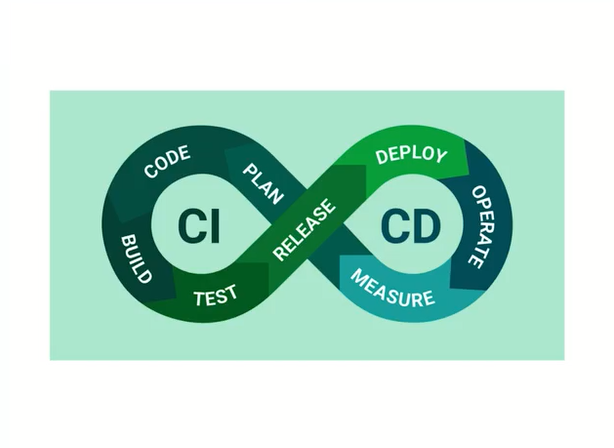

# GIT
Software local, que permite el control de versiones y manejo por ramas, principalmente funciona como una herramienta de liena de comandos(CLI)

# GITHUB
Es un servicio CLOUD, funciona como un repositorio remoto, principalmente funciona mediante una interfaz gráfica, facilita la colaboración con terceros y compartir código.

# GITHUB ACTIONS
Es una plataforma de **integración y despliegue continuo (CI/CD)**, esto permite automatizar procesos de compilación, pruebas y despliegue.

**Ventajas de github actions**
    1.- Automatizar cualquier cosa del flujo de trabajo de forma nativa. 
    2.- Todas las configuraciónes vienen en el repositorio local.
    3.- Servicio manejado.
    4.- Servicio gratuito para repositorios públicos.
    5.- Tienen más de 17 mil plantillas y automatizaciones listas para ser usado.

**Componentes y conceptos básicos de GutHub Actions**
    1.-Workflow: Proceso automatizado configurable que ejecutará uno más Jobs.
    2.-Job: Conjunto de tareas o Steps. Se ejecutan de forma secuencial.
    3.-Step: Puede contener Actions
    4.-Action: 
